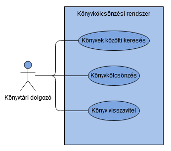

# Könyvtár program
## Funkcionális specifikáció

### Bevezetés

A Pajkaréti Községi Könyvtár 2019. szeptember 9-én keresett meg minket azzal a kéréssel, hogy a CsodaKönyvtár 1.14.4 országos pályázat keretein belül fejlesszünk számukra egy próbaprogramot - az éles szoftver előtt - hogy a lakosság és a könyvtár dolgozói digitális készségeinek fejlesztését segítsük elő. A könyvtár a szoftveres fejlesztést célozta meg a pályázat során, amelyben mi vállalunk egy olyan próbaprogram elkészítését, amit a következő pontokban részletezünk.

### A Könyvtár jelenlegi adminisztrációja
A könyvtár azzal a kéréssel fordult felénk, hogy modernizáljuk a katalógusrendszerüket, ami az alábbi módon épül fel:
* Jelenleg minden adminisztratív folyamat papíron folyik. A rendszerezéshez használt speciális adminisztrációs napló magas fenntartási költségei, illetve annak magas ökológiai lábnyoma miatt fordult cégünkhöz a Pajkaréti Közösségi Könyvtár.
* A jelenleg már működő adminisztrációs folyamatokat szeretnénk eredeti formájában megtartva digitális formába alakítani. Ezek a folyamatok speciális adminisztrációs naplókban vannak jelenleg nyilvántartva, az alábbi módon:
* Az egyszerűség kedvéért mi csupán három speciális adminisztrációs naplót kezelünk:
    * Az olvasói adatok nyilvántartását kezelő napló, amely tartalmazza az alábbiakat: az olvasókártya számát, olvasó nevét, olvasó születési dátumát és elérhetőségeit (telefonszám, lakcím, e-mail cím)
    * Az állományban fellelhető könyvek megjelenési adatait nyilvántartó napló: Cutter-számot, címét és az szerzőt
    * A kölcsönzések nyilvántartásának kezeléséért felelős napló: kikölcsönzött könyv, kölcsönző személy, kölcsönzés dátuma, visszaszolgáltatási határidő és visszaszolgáltatás dátuma

### A Könyvtár által támasztott követelmények

A Pajkaréti Közösségi Könyvtár számára az a leglényegesebb, hogy a jelenlegi papír alapú rendszerüket le tudják váltani egy modern, számítógépes nyilvántartási programra. Ehhez fontos, hogy már a próbaprogram is tartalmazza azokat az alapvető funkciókat, amiket a Könyvtár a mindennapok során használ. A fő funkciók közé az alábbi hármat lehet sorolni:

* A Könyvtár állományában történő keresés
* Olvasók könyvkölcsönzéseinek kezelése
* Olvasók könyv-visszaszolgáltatásainak kezelése

A Könyvtár további funkciókat is igényel a programba, ezek közé tartozik például az új olvasók felvétele, a meglévő olvasók adatainak módosítása, illetve a teljes könyvállomány megtekintése. A próbaprogram fejlesztése során ezeket viszont nem tudjuk biztosítani.

### Az általunk tervezett rendszer felépítése, elemei, funkciói

A programot Windows 10 64 bites operációs rendszeren tervezzük futtatni. A könyvtár számítógépeinek hardvere jelenleg ezt nem teszi lehetővé, de a CsodaKönyvtár 1.14.4 országos pályázat keretein belül tervezik a számítógépeinek lecserélését is, így mire a szoftver átadható állapotba kerül, a könyvtár számítógépei is alkalmasak lesznek az operációs rendszer, illetve a próbaprogram futtatására.

A programot úgy tervezzük kivitelezni, hogy ne igényeljen telepítést, ezáltal is könnyítve a könyvtár számítógépein történő üzembe helyezést.

A program a könyvtári dolgozó számítógépén fog futni. A könyvtári dolgozó érdekében a felhasználói felületet úgy tervezzük megvalósítani, hogy minél egyszerűbben használható legyen. Ehhez az elképzelésünk a következő:

Alapvetően három felületen tervezzük megjeleníteni a fő funkciókat:

1. Főablak, a keresési felület ablakja  
    
A főablaknak a keresési felület tekinthető, és ebből nyílik további két ablak. A program megnyitása után a keresési felület ablakát láthatjuk. Ezen keresztül elérhetjük a könyvállomány minden elemét, és láthatjuk, hogy ezek jelenleg elérhetőek-e kölcsönzésre avagy már kikölcsönzött állapotban vannak. A keresés folyamán a könyv rendszerben lévő adatai jelennek meg (Cutter-szám, szerző, cím, elérhetőség állapota), táblázatos formában.

2. Kölcsönzési felület  

A könyvtári dolgozó számára továbbá elérhető a kölcsönzés kezelési felülete is. A felület tartalmazza az olvasók listáját, amely egyedi azonosító és név formában jelenik meg (elősegítve a hasonló nevű olvasók megkülönböztetését). Az olvasó kiválasztása után a kikölcsönözni kívánt könyvre annak Cutter-számával lehet hivatkozni. Ezen két komponens kiválasztása után a program automatikus választ biztosít a tranzakció végrehajthatóságáról. A tranzakciót a jobb alsó sarokban található Elfogad gombbal lehet véglegesíteni. A tranzakció lezárása után a kölcsönzést kezelőfelület automatikusan bezárul.

3. Visszaszolgáltatási felület  
    
A visszaszolgáltatásért felelős felületen a könyvtári dolgozó lenyíló listából választhatja ki a jelenleg elérhető tranzakciókat amelyek a kikölcsönző neve és kikölcsönzött könyv címe formában jelenik majd meg. Ezt kiválasztva a dolgozó megkapja a tranzakció összes információját (tranzakció azonosítója, kölcsönző neve,  kikölcsönzött könyv címe, kölcsönzés dátuma, kölcsönzési határidő és visszaszolgáltatás ideje, ez utóbbi alapértelmezetten üres). Az ablak alsó részén található “Lezárás” gombbal lehet a tranzakciót lezárni, melynek hatására a program a visszaszolgáltatás idejét átállítja a jelenlegi dátumra. Az ablak lezárás után automatikusan bezáródik, lezárás nélkül a felhasználó manuálisan kell bezárja a felhasználói felületet.

### Használati eset diagram

A könyvtári dolgozó számára a program által nyújtott funkciók szemléltetéséhez az alábbi használati eset diagramot hoztuk létre:

### Tervezett kinézet

A cégünk saját grafikai részleggel rendelkezik, ezért fontosnak tartjuk a tervezési fázisban az általunk tervezett grafikus megoldások használatát. A Narvál 1.0 rendszer saját fejlesztésünk, amely egy projektsorozat első próbaprogramja és amelyet a Könyvtár számára rendelkezésre bocsátunk az elkészítését követően saját logóval, saját színes felülettel.

### Jelenlegi üzleti folyamatok modellje

A Pajkaréti Közösségi Könyvtár által nyújtott követelményspecifikációban leírtak szerint.

### Tervezett üzleti folyamatok modellje

Igyekszünk a Pajkaréti Közösségi Könyvtár által nyújtott követelményspecifikációban leírtaknak minden pontban megfelelő rendszert létrehozni, viszont az új olvasók hozzáadását a próbaprogram fejlesztése során nem tudjuk biztosítani.

### Kapcsolódó pályázatok
Az alábbi pályázat kapcsolódik a projekthez:
* CsodaKönyvtár 1.14.4