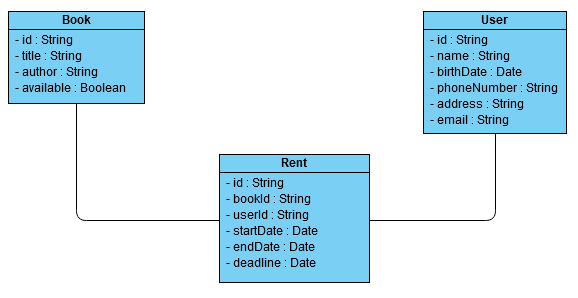

# Könyvtár projekt
## Rendszerterv

### A rendszer célja

A jelen dokumentumban részletezett rendszer célja, hogy egy könnyen áttekinthető és kezelhető felületet biztosítson a Pajkaréti Közösségi Könyvtár dolgozója számára, amin keresztül keresni tud a Könyvtár állományában, és kezelni tudja a kölcsönzéseket illetve a visszaszolgáltatásokat is. A szoftver később a lakosság egyik oktatóprogramja lehet a könyvtáron belül szervezett foglalkozások keretein belül és a felhasználók által keltett igényeneknek meg kell feleljen, ez pedig az egyszerűség és a könnyen tanulhatóság. A közönség szimpátiájának elnyerése miatt a próbaprogram neve a Narvál 1.0, amelyre ezután többnyire így hivatkozunk.

### A projekt során követett szemléletmód

A DreamForge szoftverfejlesztő cég fontosnak tartja, hogy a kezükből kiadott termék a legmagasabb minőséget képviselje. Úgy hisszük, ennek lételeme az is, hogy folyamatos kapcsolatban legyünk a megbízóinkkal, hogy kölcsönös visszajelzéseket tudjunk biztosítani egymás számára.

Ezen szemléletből fakadóan a cég agilis módszertanokat követ a fejlesztés során, konkrétan Kanbant és Scrumot. A Kanban megvalósításáért a csapatunkban a Trello nevű projektmenedzsment eszköz felel, ahol precíz módon, a legalapvetőbb lépésekig le tudjuk osztani a feladatokat és az egyéni megbeszélések helyeit, időpontjait, továbbá a kick-off meetinget is.

A csapaton belüli kommunikáció is jelentős szereppel bír a projekt megvalósítása során. Elsődlegesen élőszóban próbálunk mindent megbeszélni, azonban amikor ez nem kivitelezhető, a Slack nevű alkalmazást használjuk a csapaton belüli kommunikáció megvalósítására. 

Csapatunk tagjait a csapatmunkára alkalmas készségeik miatt választották ki a nagyobb céges csapatból erre a munkára, továbbá fontos, hogy korábbi előismeretekkel rendelkezünk más projektek kapcsán, amelyeket fel fogunk használni a könyvtári Narvál 1.0 fejlesztésekor.

Úgy hisszük, hogy a code review is nagyban hozzájárul ahhoz, hogy a program a megfelelő minőségben kerüljön a felhasználók elé, emiatt tervezzük rendszeresen átnézni és véleményezni az általunk írt programsorokat.

### Projektszerepkörök és felelősségeik

A cég 4 fős csapata fog dolgozni a projekten. A kis létszámból adódóan nincsenek hagyományos értelemben vett szerepkörök definiálva, mindenki igyekszik a legtöbb munkálatba belefolyni. Azonban vannak olyan területek, amihez egy bizonyos személy jobban ért, mint a többiek, ezért úgy éreztük, hogy fontos az, hogy bizonyos részterületekhez kinevezzünk egy-egy felelőst, akihez a felmerülő problémák esetén lehet fordulni. A felelősök megnevezése, az általuk reprezentált speciális területtel:

* Kovács Nikolett: kinézet, felhasználói felület
* Kövér Krisztián: adatok kezelése
* Sárvári Dániel: tesztelés
* Nagy Márta: programhelyesség

Ahogy az már korábban említésre került, a csapat a Scrum módszertant követi, annak minden szabályának betartásával együtt. Ennek fényében szükséges további szerepkörök definiálása, ami az alábbiak szerint alakul:

* Nagy Márta: Scrum Master
    
A szerepkör lényege, hogy biztosítsa a fejlesztőcsapatban a Scrum elvek betartását. Ő felelős azért, hogy a Scrum Meetingek megfelelően legyenek lebonyolítva, illetve hogy annak szabályai is teljesülnek. Feladata egy olyan környezet megteremtése, amelyben a csapat effektíven dolgozhat. Ha a csapat valamilyen akadályba ütközik, akkor a Scrum Master feladata, hogy elhárítsa azt. Fontos azonban látni, hogy a Scrum Master nem tekinthető projektvezetőnek, mivel a csapatnak önszerveződő.

* Kovács Nikolett: Product Owner
    
A szerepkör felelősségteljes pozíció abban az ügyben, hogy a fejlesztőcsapat által elkészített termék a legmagasabb minőséget képviselje. Ő a felelős a kapcsolattartásért, amely során közvetítő szerepet tölt be a két fél között - jelen esetben a Könyvtár és a fejlesztőcsapat vonatkozásában. Egyeztet a Könyvtárral, hogy az elképzeléseiket megfelelően továbbítani tudja a fejlesztőcsapat felé, ezáltal meghatározva a csapat feladatainak prioritásait is. Biztosítja, hogy a csapat számára a Product Backlog érthető, és tiszta legyen, hogy világosan láthassa a csapat, hogy min szükséges dolgozniuk. Jelentős szerepet tölt be annak érdekében, hogy a program az igényeknek legmegfelelőbb legyen. Ehhez szükséges a magas fokú empátiakészség, a türelem és a jó kommunikációs képesség megléte.

### Ütemterv

A Könyvtár által megszabott határidőt (2019. szeptember 16. - 2019. szeptember 30.), azaz a 2 hetes keretet mindenképpen be kell tartanunk, ami miatt az ütemterv meglehetősen sűrűnek bizonyul.

A Scrum által meghatározott Scrum Meetingeket mindenképpen meg fogjuk szervezni, ezek lebonyolításáért a Scrum Masterünk felel.
Mivel a teljes projektre 2 hét áll rendelkezésünkre, így ezt 1 sprinten belül szükséges végrehajtanunk. Ezek alapján a sprint az alábbi Scrum Meetingeket foglalja magában:

* Daily Scrum: minden nap ugyanabban az időpontban, 15 percben lebonyolítva
    * Ezen találkozó keretein belül tudunk beszélni az aktuális napi előrehaladásunkról
* Sprint Planning: 2019. szeptember 16-án
    * Ezen találkozó keretein belül tervezzük meg a teljes sprint menetét, illetve annak szükséges feladatait
* Backlog Grooming: 2019. szeptember 23-án
    * Ezen találkozó keretein belül tudunk finomítani az elképzeléseinken, ha a sprint során úgy érezzük, hogy valami változásra szorul
* Sprint Review: 2019. szeptember 30-án
    * Ezen találkozó keretein belül mutatjuk be az elkészült programot
* Sprint Retrospective: 2019. szeptember 30-án
    * Ezen találkozó keretein belül beszéljük át a véghezvitt sprint sikerességét, illetve hogy mi az, amin az elkövetkező sprintek során javítani lehetne

### Üzleti szereplők

Jelen projektben az üzleti oldalon a Pajkaréti Közösségi Könyvtár áll, legfőképp annak könyvtári dolgozója, mivel ő lesz az, aki az elkészült programot használni fogja. A Könyvtárral a fejlesztőcsapat a Product Owner segítségével kommunikál, ő az a személy, aki a visszajelzéseket közvetíti az üzleti és a fejlesztői oldal képviselői számára.

### Üzleti követelmények

A Pajkaréti Közösségi Könyvtár által támasztott követelményeket követi a projekt. Azaz vállaljuk egy olyan Windows 10 60 bites operációs rendszeren futó, telepítést nem igénylő program megvalósítását, amelyen keresztül a könyvtári dolgozó nyilván tudja tartani a könyvek kölcsönzését és visszaszolgáltatását, illetve a program segítségével az állományban történő keresést is meg tudja valósítani. További elvárás az is a Könyvtár részéről, hogy a megadott határidőre (2019. szeptember 30.) elkészüljön a program.

### Üzlet által elvárt funkciók

A Pajkaréti Közösségi Könyvtár elsősorban egy próbaprogram fejlesztését bízta cégünkre. Értelmezésünk szerint ezt a programot a későbbiekben további funkciókkal szeretnék ellátni. A próbaprogramot tehát tekinthetjük egy Minimum Viable Productnak, amit a későbbiekben szándékozunk továbbfejleszteni, ha a Könyvtárral való együttműködés sikeresnek bizonyul.

 Ezek alapján tehát a próbaprogram az alábbi funkcionalitásokat szükséges, hogy tartalmazza:

* A Könyvtár állományában történő keresés
* Olvasók könyvkölcsönzéseinek kezelése
* Olvasók könyv-visszaszolgáltatásainak kezelése

### Környezet és használt technológiák, eszközök

Az elkészült program a Pajkaréti Közösségi Könyvtár számítógépein fog futni, amelyek jelen állapotukban nem alkalmasak arra, hogy a Windows 10 64 bites operációs rendszert futtassák, viszont a CsodaKönyvtár 1.14.4 országos pályázat keretein belül tervezik ezen számítógépek komponenseinek lecserélését, ezáltal az operációs rendszer és a program futtatása már nem fog gondot okozni. Azért ezt az operációs rendszert választottuk, mivel az erre a platformra történő fejlesztésben van a csapatunknak tapasztalata, illetve fontos szempont volt az is, hogy a választott operációs rendszer hosszú távon támogatott legyen. A CsodaKönyvtár 1.14.4 országos pályázat várhatóan biztosítani fogja az operációs rendszer licenszek megvásárlásához szükséges pénzügyi keretet is. Ha a Könyvtár igényli, akkor biztosítani tudunk számukra szakembereket, akik segíteni tudnak az operációs rendszer megfelelő feltelepítésében.

A programot Java programozási nyelven tervezzük megírni, azon belül is a Java SE Development Kit 11-et használva. Cégünk leginkább Java nyelven írt alkalmazások fejlesztésében tapasztalt, emiatt esett a választás erre a programozási nyelvre. A céges környezetünkben leginkább a Java SE Development Kit 8 van elterjedten használva, viszont a hosszabb támogatottsági idő reményében ezen projekt során a 11-es verziót fogjuk használni.

A számítógépekre várhatóan telepítve lesz a Java SE Development Kit 11, ami a használt programozási nyelvből adódóan szintén szükséges az elkészült program futtatásához.

A felhasználói felület kialakításához JavaFX technológiát tervezünk használni, CSS stíluslapokkal javítva annak megjelenésén. A választásunk azért esett erre a technológiára, mivel a csapatunkon belül ezt a technológiát ismerjük a legjobban. Manapság ez a technológia már nem annyira népszerű, viszont mi mégis bízunk abban, hogy megfelelő felhasználói felületet fog tudni biztosítani a fejlesztendő programunk számára.

A szoftverprojekt menedzselésére és a buildelés automatizálására az Apache Maven nevű eszközt használjuk. Azért ezt az eszközt választottuk, mivel kompatibilis a Java programozási nyelvvel, és a felmerülő alternatívák vagy túl elavultnak számítanak manapság (pl. Apache Ant), vagy pedig nem ismerjük őket annyira, hogy megfelelő magabiztossággal tudjuk alkalmazni (pl. Gradle). A kezeléséhez szükséges bizonyos szintű XML tudás, viszont azt a fejlesztőcsapaton belül mindannyian magabiztosan ismerjük és alkalmazzuk, így ez nem fog gondot okozni.

A perzisztens adatkezelés megvalósítására a Java Persistence API-t tervezzük használni. Ezen belül a Hibernate objektum-relációs leképezés eszközzel szándékozunk dolgozni a JPA implementációk közül. A csapat korábbi tapasztalatai alapján felmerült még további lehetőségként a JAXB, tehát az XML alapú perzisztens adatkezelés, illetve a Gson is, ami pedig JSON alapú. Viszont ezek a CRUD, azaz a Create, Read, Update és Delete műveletek közül az Update-et nem támogatják, a program megvalósításakor viszont várhatóan szükségünk lesz rá, emiatt le kellett mondanunk a használatukról. A JPA-t a Google Guice nevű függőség befecskendezési keretrendszer segítségével tervezzük használni.

Korábbi pozitív tapasztalataink alapján mindenképpen szeretnénk használni a Project Lombok nevű Java könyvtár által nyújtotta lehetőségeket, mivel rengeteg hasznos funkcióval könnyíti meg a fejlesztők életét. A könyvtár főként annotációkat definiál, amelyekkel egyszerűen és átláthatóan generálhatóak konstruktorok, getterek, setterek, illetve tartalmaz annotációt a Builder tervezési minta alkalmazásához is.

A hibakeresésben fontos szerepet játszik a logolás, úgy gondoljuk, hogy a hasznos log üzenetek jelentősen megkönnyíthetik a fejlesztők életét. Emiatt tervezzük valamelyik lightweight logolási keretrendszer használatát is. Többféle ilyennel is van már korábbi tapasztalatunk, pl. SLF4J, TinyLog, Java.util.logging, Logback, Log4j. A fejlesztőcsapat ezen projekt során várhatóan az SLF4J-t felhasználva fogja kezelni a logolást. A logolásra nem tervezünk konkrét log fájl létrehozását, illetve abba való kiíratást, hanem csak egyszerűen a standard outputra fogunk hagyatkozni.

Az egyszerű futtatás érdekében az elkészült programhoz szeretnénk az Apache Maven Shade Plugin segítségével egy futtatható JAR fájlt is létrehozni.

### Architekturális terv

Szoftverarchitektúrák tekintetében a Model-View-Controller, azaz az MVC szerkezeti mintát tervezzük követni. Ez alapján a szoftvert 3 szerkezeti részre lehet felosztani:

1. Modell (Model)  
    * Az alkalmazás által kezelt adatokat, illetve az üzleti logikát tartalmazza, független a megjelenítéstől
    * Ezt a réteget reprezentálják a perzisztens adatkezelés megvalósításához felhasznált POJO-k
2. Nézet (View)  
    * A felhasználói felület, amely a felhasználó számára prezentálja az alkalmazás adatait
    * Ezt a réteget reprezentálják a kinézetért felelős FXML fájlok
3. Vezérlő (Controller)  
    * Kezeli a felhasználótól származó bemenetet és ez alapján a modell vagy a nézet felé szolgáltatáskéréseket tesz
    * Ezt a réteget reprezentálják a Controller osztályok

Az átláthatóság érdekében a projekt könyvtárszerkezetét is ehhez igazodva tervezzük létrehozni.

### Adatbázis terv
Elképzeléseink szerint az adatbázis három táblát fog tartalmazni, amelyek a következők:
* Book  
    Ez a tábla tartalmazza a könyvállomány könyveit, illetve azok adatait:
    * Egyedi azonosító (Cutter-szám)
    * Cím
    * Szerző
    * Elérhető-e jelenleg kölcsönzésre a könyvtárban
* User  
    Ez a tábla tartalmazza a könyvtár olvasóit, illetve azok adatait:
    * Egyedi azonosító (olvasójegyszám)
    * Név
    * Születési dátum
    * Telefonszám
    * Lakcím
    * Email cím
* Borrowing  
    Ez a tábla tartalmazza a kölcsönzéseket, illetve azok adatait:
    * Egyedi azonosító (kölcsönzési azonosító)
    * A kölcsönzéshez tartozó könyv egyedi azonosítója
    * A kölcsönzést kezdeményező olvasó egyedi azonosítója
    * A kölcsönzés kezdete
    * A kölcsönzés vége (ha nincs értéke, akkor az adott könyv még nem került visszaszolgáltatásra a kölcsönző által)
    * A kölcsönzés határideje (az az idő, amikor legkésőbb vissza kell vinnie az olvasónak a kikölcsönzött könyvet)
    
A Book és a Borrowing táblák között 1:1 kapcsolat áll fenn, a User és a Borrowing között pedig 1:N, mivel:
* Egy könyvhöz csak egy kölcsönzés tartozhat, és egy kölcsönzéshez is egy könyv tartozhat (mivel a könyvek egyedi azonosító szerint vannak tárolva).
* Egy olvasóhoz tartozhat több kölcsönzés is, viszont egy kölcsönzés csak egy olvasóhoz tartozhat.

### Implementációs terv

Az adatbázis tervben említett adatbázis táblák mindegyikéhez tartozik egy-egy POJO, azaz Plain Old Java Object, ezek kezdetleges tervét a lenti UML diagram szemlélteti. Ezek lesznek a JPA entitások.

### Tesztelési terv

A határidő közelsége miatt, illetve a viszonylag kevés funkcionalitásból adódóan csupán manuális tesztet tervezünk végrehajtani a programon. Ezt egy megfelelő tesztelési dokumentációban tervezzük dokumentálni. Igyekszünk a lehető legtöbb szempontot figyelembe venni a három fő funkció minél biztosabb tesztelése érdekében.

### Telepítési terv

Elképzeléseink alapján az elkészült program nem fog telepítést igényelni, csupán Windows 10 64 bites operációs rendszerre és Java SE Development Kit 11-re lesz szükség a számítógépeken. Az egyszerűség kedvéért a programot egy futtatható JAR fájl segítségével lehet majd elindítani, további beállítást nem fog igényelni. A szükséges környezet megteremtésében rendelkezésre állunk szaktudásunkkal a könyvtár számára.

### Karbantartási terv

Felmerülő problémák esetén a Pajkaréti Közösségi Könyvtár bármikor fordulhat hozzánk a kérdéseikkel, továbbá tervezünk írni számukra egy technikai dokumentációt is, ami tulajdonképpen egy használati utasításként szolgál, hogy minél egyszerűbben megtanulhassák a program kezelését, ezáltal próbálva lecsökkenteni az esetleges felhasználói általi hibalehetőségeket.

A szerződésben lefektetett másik programon a próbaszoftver elkészítése során elkezdünk dolgozni és Product Ownerünk - Kovács Nikolett - vállalta magára a jövőbeli kapcsolattartást is a két fél között. Miközben a nagy programunk fejlesztése történik, folyamatos figyelemmel kísérjük a már közreadott próbaverziót. A korábban megbeszéltek szerint a próbaprogram a lakossághoz kerül a digitális kompetenciájuk növelése érdekében, amely szélesebb körű tesztelést tesz lehetővé és egyúttal folyamatosan monitoringozásra kerül a lakosság igénye, a jövőbeli eredményesebb fejlesztés érdekében.
